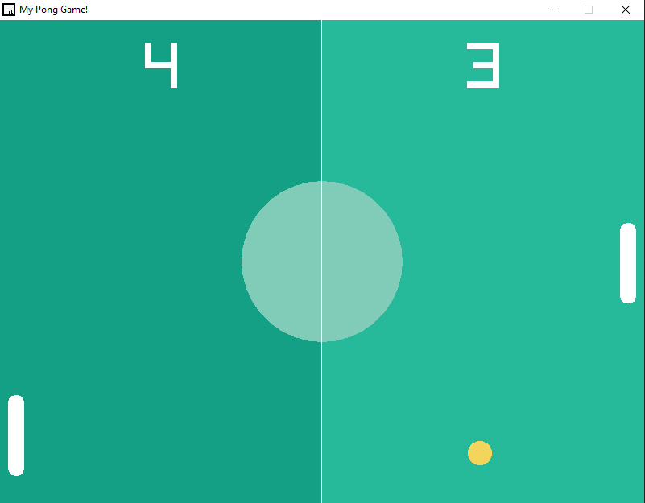

# C++ Pong Game using raylib

Welcome to the C++ Pong Game repository! This project showcases a classic Pong game built with the C++ programming language and the raylib library. The game is designed to run smoothly on Windows, macOS, and Linux.

## Table of Contents

- [Features](#features)
- [Installation](#installation)
- [Usage](#usage)
- [Gameplay](#gameplay)
- [Contributing](#contributing)
- [Credits](#credits)
- [Screenshot](#screenshot)

## Features

- **Cross-Platform**: Playable on Windows, macOS, and Linux.
- **Graphics**: Utilizes raylib for rendering simple yet engaging graphics.
- **Audio**: Classic sound effects powered by raylib.
- **Input Handling**: Smooth and responsive controls for an enjoyable gaming experience.
- **Open Source**: Well-structured and readable code for educational purposes.

## Installation

To get started with the C++ Pong game, follow these steps:

### Prerequisites

- Ensure you have a C++ compiler installed (e.g., GCC, Clang, MSVC).
- Download and install the [raylib](https://www.raylib.com/) library.

### Building the Game

1. Clone this repository:
    ```sh
    git clone https://github.com/yourusername/pong-raylib.git
    cd pong-raylib
    ```

2. Compile the source code:
    ```sh
    g++ -o pong main.cpp -lraylib -lm -ldl -lpthread -lX11
    ```

3. Run the game:
    ```sh
    ./pong
    ```

## Usage

Simply run the compiled executable to start playing the game. Use the following controls to play:

- **Player 1 Controls**:
  - **W**: Move paddle up
  - **S**: Move paddle down

- **Player 2 Controls**:
  - **Up Arrow**: Move paddle up
  - **Down Arrow**: Move paddle down

## Gameplay

Pong is a two-player game where each player controls a paddle and tries to hit the ball into the opponent's goal. The game continues until one player reaches the set score limit.

## Contributing

Contributions are welcome! If you find any bugs or have ideas for new features, feel free to open an issue or submit a pull request. Please ensure your contributions adhere to the project's coding standards and guidelines.


## Credits

- **raylib**: [Raylib](https://www.raylib.com/) library by [Ray San](https://github.com/raysan5)
- **Pong Concept**: Originally designed by Atari

## Screenshot



---

Happy gaming and happy coding! 🎮🚀
